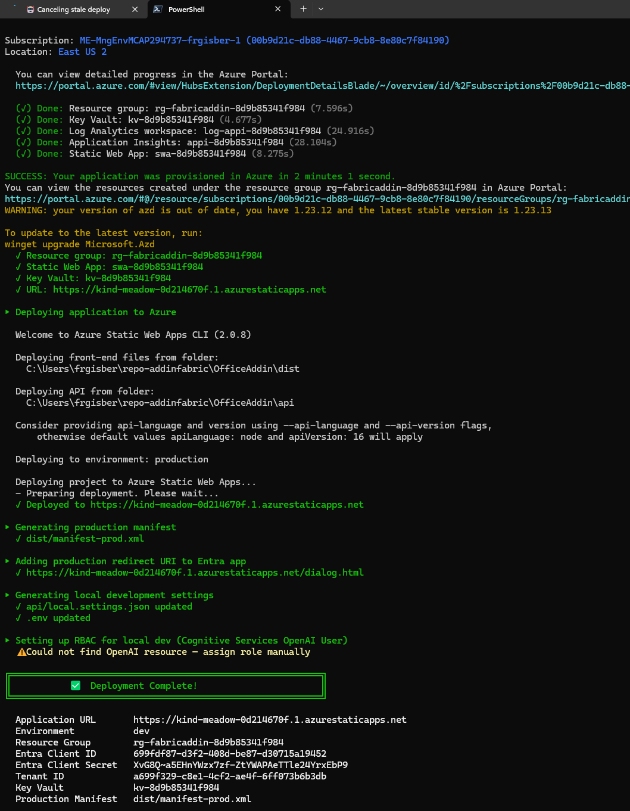

# Fabric Storyboard Copilot

A PowerPoint Office Add-in that integrates with Microsoft Fabric and Power BI to browse workspaces, export report pages as images, insert them into slides, and generate AI-powered executive insights.

**Built entirely with AI-powered development tools** — no manual coding in a traditional IDE. The initial v0.1 scaffold (57 files, 5K+ LOC, 68 tests) was generated by [Squad](https://github.com/bradygaster/squad), an AI agent team framework, in ~1.3 hours. All subsequent integration, debugging, GPT-4o Vision, UI polish, and deployment were done with [GitHub Copilot CLI](https://docs.github.com/en/copilot/github-copilot-in-the-cli) (powered by Claude Opus 4.6) over ~12 additional hours. Total effort from zero to v1 deployed: **~13.3 hours**.

## Screenshots

### Insert Page with Insights

*A slide with a chart on the left and AI-generated executive insights on the right. The taskpane shows Preview & Insert, AI Insights, and One-Click Insert sections.*

### Full Workflow Result

*Five slides exported: report page image + AI insights text side by side. The taskpane shows generated insights cards and the Insert Insights button.*

### Taskpane UI

*Main taskpane: workspace browser with breadcrumb navigation (Workspaces > FGIMain > Store Sales), export button, preview with layout options, and AI Insights section.*

### Complete Workflow

*Full session with 6 slides populated from Retail Analysis report. Taskpane shows workspace navigation (Chapter11 > Retail Analysis), District Monthly Sales export with layout options, and AI Insights generation.*

## Documentation

- [Architecture](docs/architecture.md) — System architecture, component diagrams, data flows (Mermaid)
- [Implementation Plan](docs/plan.md) — Full phased plan with architecture, auth flows, and technical details
- [Entra ID Setup](docs/entra-setup.md) — App registration and permission configuration
- [Task Dependencies](docs/dependencies.md) — Dependency graph, critical path, Gantt chart (Mermaid diagrams)
- [Effort & Cost Estimation](docs/estimation.md) — Role split, effort estimates, Azure costs, and agent fleet savings

## Tech Stack

| Layer | Technology |
|-------|-----------|
| Frontend | React + TypeScript + Office.js + Fluent UI v9 |
| Backend | Azure Functions (Node.js v4 / TypeScript) |
| Auth | MSAL.js + Entra ID (SSO + OBO flow) |
| AI | Azure OpenAI (GPT-4o / GPT-4o Vision) via Managed Identity |
| Data | Power BI REST API + Export API |
| Hosting | Azure Static Web Apps |
| IaC | Bicep + Azure Developer CLI (`azd`) |
| CI/CD | GitHub Actions |

## Prerequisites

| Prerequisite | Install |
|---|---|
| **PowerShell** 7+ | [Install](https://learn.microsoft.com/powershell/scripting/install/installing-powershell) |
| **Node.js** v18+ | [nodejs.org](https://nodejs.org/) |
| **Azure CLI** (`az`) | [Install](https://aka.ms/install-azure-cli) |
| **Azure Developer CLI** (`azd`) | [Install](https://aka.ms/install-azd) |
| **Azure subscription** | With permissions to create resources and app registrations |

For local development, you also need:
- [Azure Functions Core Tools](https://learn.microsoft.com/azure/azure-functions/functions-run-local) v4
- [PowerPoint](https://www.microsoft.com/microsoft-365) (Desktop or Web) for sideloading
- A Power BI workspace with at least one report

---

## Deploy to Azure

### Option A — Automated Deployment (Recommended)

The `deploy.ps1` script handles **everything**: Entra ID app registration, Azure infrastructure, build, tests, deploy, and local dev config.

```powershell
git clone https://github.com/<your-org>/OfficeAddin.git
cd OfficeAddin
.\deploy.ps1
```

The script is interactive and prompts you for:
- **Environment name** (e.g., `dev`, `prod`)
- **Azure region** (e.g., `eastus2`)
- **Azure OpenAI** — deploy a new resource, or provide an existing endpoint URL

Everything else is automated:

```
╔══════════════════════════════════════════════════════════╗
║    Fabric Storyboard Copilot — One-Click Deploy         ║
╚══════════════════════════════════════════════════════════╝

 1. Checking prerequisites        ✓ Node.js, npm, az, azd
 2. Authenticating with Azure     ✓ Signed in
 3. Gathering configuration       → prompts for env, region, OpenAI
 4. Configuring Entra ID          ✓ App registered, scopes, secret
 5. Installing dependencies       ✓ npm ci (frontend + backend)
 6. Building application          ✓ webpack + tsc
 7. Running tests                 ✓ 68 tests passed
 8. Provisioning infrastructure   ✓ SWA, Key Vault, App Insights, RBAC
 9. Deploying application         ✓ https://xxx.azurestaticapps.net
10. Generating manifest           ✓ dist/manifest-prod.xml
11. Configuring local dev         ✓ .env + api/local.settings.json
```

At the end, the script displays the **Entra Client ID**, **Client Secret**, and a **copy-paste redeploy command** for future runs.

| Add-in result with AI insights | One-click deployment to Azure |
|:---:|:---:|
|  |  |

<details>
<summary><b>Non-interactive / CI usage</b></summary>

```powershell
# Redeploy with existing Entra app:
.\deploy.ps1 -EnvironmentName prod -Location westeurope `
    -EntraClientId "00000000-..." -EntraClientSecret "secret" `
    -OpenAiEndpoint "https://my-oai.openai.azure.com/"

# All parameters:
#   -EnvironmentName    Azure env name (dev, staging, prod)
#   -Location           Azure region (eastus2, westeurope, etc.)
#   -EntraClientId      Existing Entra app client ID
#   -EntraClientSecret  Existing Entra client secret
#   -OpenAiEndpoint     Existing Azure OpenAI endpoint URL
#   -OpenAiDeployment   Model deployment name (default: gpt-4o)
#   -SkipTests          Skip running the test suite
#   -SkipBuild          Skip build step (assume already built)
```

</details>

#### What gets created

| Resource | Purpose | Auth |
|----------|---------|------|
| **Azure Static Web App** (Standard) | Frontend + API hosting | System-assigned Managed Identity |
| **Azure Key Vault** | Stores secrets (provisioning-time use) | SWA reads via Managed Identity (RBAC) |
| **Azure OpenAI** (optional) | GPT-4o for AI insights | SWA calls via Managed Identity (RBAC) |
| **Application Insights** | Monitoring and diagnostics | Connection string |
| **Entra ID App Registration** | SSO + OBO token exchange | Client secret in Key Vault |

> **🔒 Security model:** No API keys in code or config. Azure OpenAI is accessed via Managed Identity. The Entra client secret (required by OAuth2 OBO flow) is set directly as an SWA app setting (Azure Static Web Apps do **not** support `@Microsoft.KeyVault()` references — that feature is App Service-only).

---

### Option B — Manual Deployment

<details>
<summary>Click to expand manual deployment steps</summary>

#### Additional prerequisites

In addition to the [prerequisites above](#prerequisites), you need:
1. An [Entra ID app registration](docs/entra-setup.md) (created manually)
2. An existing Azure OpenAI resource with a GPT-4o deployment

#### Step 1: Set up Entra ID

Follow [docs/entra-setup.md](docs/entra-setup.md) to register an app, configure permissions, and generate a client secret.

#### Step 2: Provision with Azure Developer CLI

```bash
azd auth login
azd up        # Provision infrastructure + deploy
```

Or separately:
```bash
azd provision   # Create Azure resources (Bicep)
azd deploy      # Deploy app code
```

Set the following environment variables when prompted, or in `.azure/<env>/.env`:

```
AZURE_LOCATION=eastus2
DEPLOYMENT_ID=<any-unique-13char-id>
ENTRA_CLIENT_ID=<your-client-id>
ENTRA_TENANT_ID=<your-tenant-id>
ENTRA_CLIENT_SECRET=<your-client-secret>
AZURE_OPENAI_ENDPOINT=https://<your-resource>.openai.azure.com/
AZURE_OPENAI_DEPLOYMENT=gpt-4o
```

> ⚠️ **SWA limitation:** `ENTRA_CLIENT_SECRET` must be set as a plain value — SWA does not support Key Vault references.  
> **Note:** `AZURE_OPENAI_ENDPOINT` must be the base URL only. Do not append `/openai/v1/`.

#### Step 3: Generate production manifest

```powershell
(Get-Content manifest.xml) -replace 'https://localhost:3000', 'https://<your-swa>.azurestaticapps.net' |
    Set-Content dist/manifest-prod.xml
```

</details>

---

## Post-Installation: Load the Add-in in PowerPoint

After deploying (automated or manual), you need to load the add-in in PowerPoint.

> Use `dist/manifest-prod.xml` for Azure-deployed versions, or `manifest.xml` for local development.

### Sideload (individual use)

#### PowerPoint Desktop (Windows / Mac)

1. Open PowerPoint
2. Go to **Insert** → **My Add-ins** → **Manage My Add-ins**
3. Click **Upload My Add-in**
4. Browse to `dist/manifest-prod.xml`
5. Click **Upload**

#### PowerPoint Online

1. Go to [PowerPoint Online](https://www.office.com/launch/powerpoint)
2. Open a presentation
3. Go to **Insert** → **Office Add-ins** → **Upload My Add-in**
4. Browse to `dist/manifest-prod.xml`

### Organization-wide deployment

1. Go to [Microsoft 365 Admin Center](https://admin.microsoft.com) → **Settings** → **Integrated apps**
2. Click **Upload custom apps**
3. Upload `dist/manifest-prod.xml`
4. Assign to users/groups

After loading, the add-in appears in the **Home** ribbon tab. Click the button to open the task pane.

---

## Local Development

After deploying (automated or manual), `deploy.ps1` generates the local config files automatically. If deploying manually, create them by hand.

### Environment files

**`.env`** (project root — used by webpack):
```env
ENTRA_CLIENT_ID=<your-app-client-id>
ENTRA_TENANT_ID=<your-tenant-id>
```

**`api/local.settings.json`** (Azure Functions backend):
```json
{
  "IsEncrypted": false,
  "Values": {
    "AzureWebJobsStorage": "",
    "FUNCTIONS_WORKER_RUNTIME": "node",
    "ENTRA_CLIENT_ID": "<your-app-client-id>",
    "ENTRA_TENANT_ID": "<your-tenant-id>",
    "ENTRA_CLIENT_SECRET": "<your-client-secret>",
    "AZURE_OPENAI_ENDPOINT": "https://<your-resource>.openai.azure.com",
    "AZURE_OPENAI_DEPLOYMENT": "gpt-4o"
  },
  "Host": {
    "CORS": "https://localhost:3000",
    "CORSCredentials": true
  }
}
```

> **No API key needed for Azure OpenAI.** The backend uses `DefaultAzureCredential`:
> - **Managed Identity** in Azure (system-assigned on SWA)
> - **Azure CLI credentials** locally (requires `az login`)
>
> Ensure you have the **Cognitive Services OpenAI User** role on your OpenAI resource:
> ```bash
> az role assignment create --assignee <your-email> \
>   --role "Cognitive Services OpenAI User" \
>   --scope /subscriptions/<sub>/resourceGroups/<rg>/providers/Microsoft.CognitiveServices/accounts/<resource>
> ```

### Run locally

```bash
# Terminal 1 — Frontend (webpack dev server with HTTPS)
npm start          # https://localhost:3000

# Terminal 2 — Backend (Azure Functions)
cd api && npm start  # http://localhost:7071
```

Then sideload `manifest.xml` (not `manifest-prod.xml`) in PowerPoint — see [Post-Installation](#post-installation-load-the-add-in-in-powerpoint).

---

## Available Scripts

### Frontend (root)

| Script | Command | Description |
|--------|---------|-------------|
| Start dev server | `npm start` | Webpack dev server with HTTPS on port 3000 |
| Build for production | `npm run build` | Webpack production bundle to `dist/` |
| Lint | `npm run lint` | ESLint check on `src/` |
| Test | `npm test` | Jest unit tests |

### Backend (`api/`)

| Script | Command | Description |
|--------|---------|-------------|
| Start Functions | `npm start` | Build + `func start` on port 7071 |
| Build | `npm run build` | TypeScript compilation |
| Watch | `npm run watch` | TypeScript watch mode |
| Test | `npm test` | Jest unit tests |

## Project Structure

```
OfficeAddin/
├── src/taskpane/          # React frontend (components, hooks, services)
├── api/src/               # Azure Functions backend (endpoints, services)
├── infra/                 # Bicep IaC templates
├── docs/                  # Documentation
├── dist/                  # Build output
├── manifest.xml           # Office Add-in manifest
├── azure.yaml             # azd deployment config
├── webpack.config.js      # Frontend bundling
├── jest.config.js         # Test configuration
└── package.json           # Dependencies & scripts
```

See [docs/architecture.md](docs/architecture.md) for detailed component diagrams and data flows.

## License

Private — Microsoft Internal.