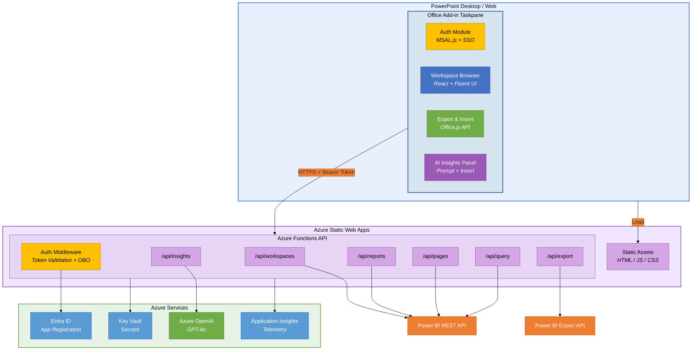
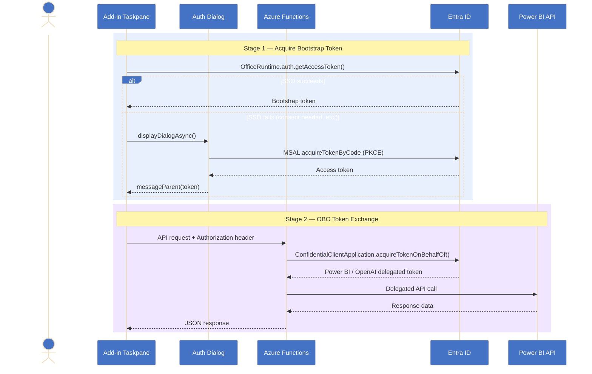
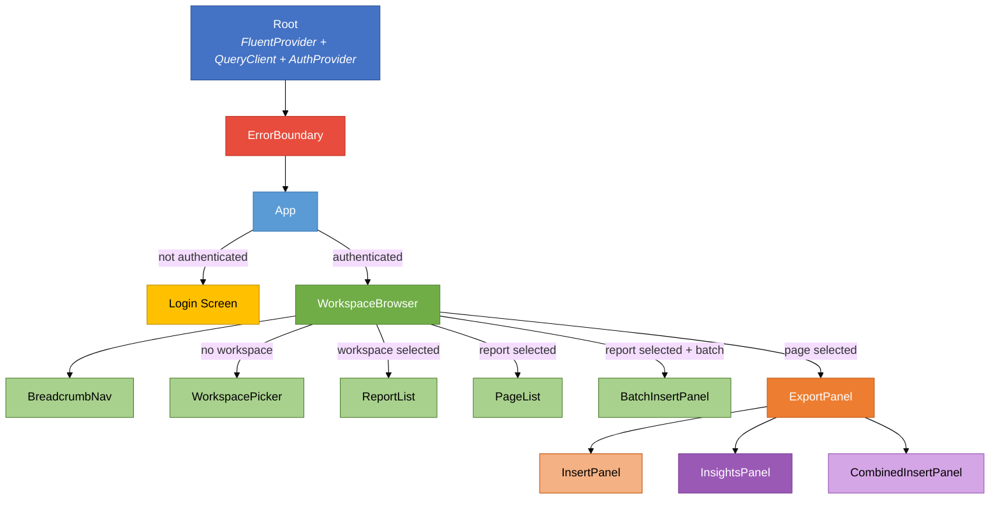
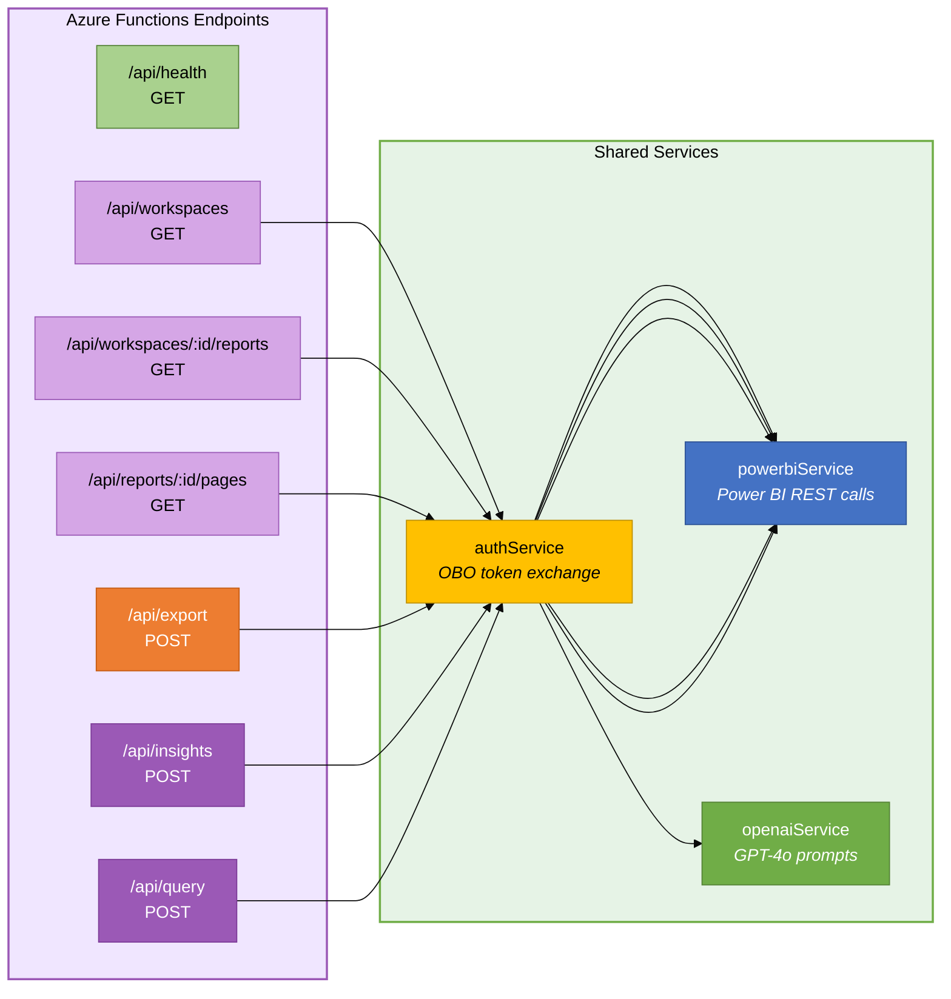
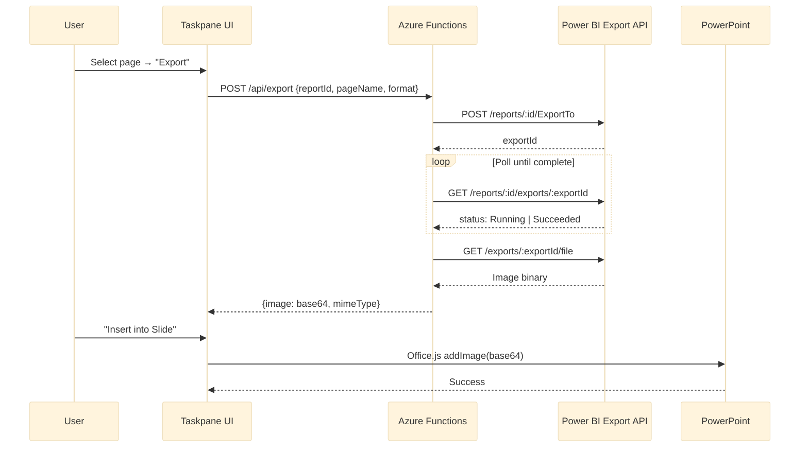
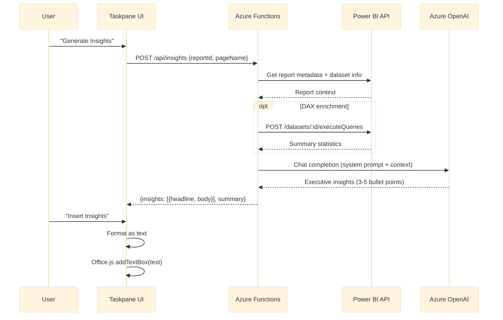
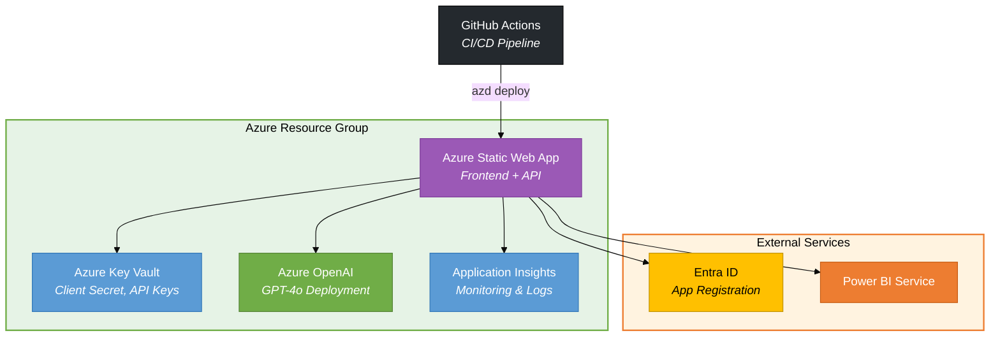

# Architecture — Fabric Storyboard Copilot

This document describes the system architecture, component structure, data flows, and deployment topology of the **Fabric Storyboard Copilot** PowerPoint add-in.

---

## System Overview



---

## Authentication Flow

The add-in uses a two-stage auth approach: **SSO** first, with a **dialog fallback** for interactive login. The backend performs **On-Behalf-Of (OBO)** token exchange.



### Key Auth Components

| Component | Location | Purpose |
|-----------|----------|---------|
| `AuthProvider` / `AuthContext` | `src/taskpane/services/auth/AuthContext.tsx` | React context providing auth state |
| `useAuth` hook | `src/taskpane/services/auth/useAuth.ts` | Hook wrapping AuthContext for components |
| `ssoAuth` | `src/taskpane/services/auth/ssoAuth.ts` | Office SSO token acquisition |
| `dialogAuth` | `src/taskpane/services/auth/dialogAuth.ts` | MSAL dialog fallback flow |
| `msalConfig` | `src/taskpane/services/auth/msalConfig.ts` | MSAL configuration |
| `authService` | `api/src/services/authService.ts` | Backend OBO exchange with `@azure/msal-node` |

---

## Frontend Component Hierarchy



---

## Backend API Endpoints



### API Details

| Endpoint | Method | Description | Upstream API |
|----------|--------|-------------|--------------|
| `/api/health` | GET | Health check | — |
| `/api/workspaces` | GET | List user workspaces | Power BI `GET /v1.0/myorg/groups` |
| `/api/workspaces/:id/reports` | GET | List reports in workspace | Power BI `GET /v1.0/myorg/groups/:id/reports` |
| `/api/reports/:id/pages` | GET | List pages in report | Power BI `GET /v1.0/myorg/reports/:id/pages` |
| `/api/export` | POST | Export page as image (PNG/JPEG) | Power BI Export API (async polling) |
| `/api/insights` | POST | Generate AI executive insights | Azure OpenAI GPT-4o |
| `/api/query` | POST | Execute DAX query on dataset | Power BI `executeQueries` |

---

## Data Flow — Export & Insert



---

## Data Flow — AI Insights



---

## Infrastructure Topology



### Bicep Modules

| Module | Resource | Purpose |
|--------|----------|---------|
| `infra/main.bicep` | Root template | Orchestrates all modules |
| `infra/modules/staticwebapp.bicep` | Static Web App | Hosts frontend + Azure Functions |
| `infra/modules/keyvault.bicep` | Key Vault | Stores secrets (client secret, OpenAI key) |
| `infra/modules/openai.bicep` | Azure OpenAI | GPT-4o deployment for insights |
| `infra/modules/monitoring.bicep` | Application Insights | Telemetry and logging |

---

## Project Structure

```
OfficeAddin/
├── src/
│   └── taskpane/
│       ├── components/        # React UI components
│       │   ├── App.tsx                 # Main app (auth gate + layout)
│       │   ├── WorkspaceBrowser.tsx    # Navigation orchestrator
│       │   ├── WorkspacePicker.tsx     # Workspace selection (Combobox)
│       │   ├── ReportList.tsx          # Report card list with filter
│       │   ├── PageList.tsx            # Page card list with export
│       │   ├── BreadcrumbNav.tsx       # Workspace > Report > Page nav
│       │   ├── ExportPanel.tsx         # Export page to image
│       │   ├── InsertPanel.tsx         # Insert image into slide
│       │   ├── InsightsPanel.tsx       # AI insights generation
│       │   ├── CombinedInsertPanel.tsx # Image + Insights one-click
│       │   ├── BatchInsertPanel.tsx    # Multi-page batch insert
│       │   └── ErrorBoundary.tsx       # Global error boundary
│       ├── hooks/
│       │   ├── usePowerBI.ts           # React Query hooks for Power BI
│       │   └── useInsights.ts          # React Query hooks for AI
│       ├── services/
│       │   ├── api/
│       │   │   ├── powerbiClient.ts    # Axios-based API client
│       │   │   └── insightsClient.ts   # Insights API client
│       │   ├── auth/
│       │   │   ├── AuthContext.tsx      # Auth React context + provider
│       │   │   ├── useAuth.ts          # Auth hook
│       │   │   ├── ssoAuth.ts          # Office SSO flow
│       │   │   ├── dialogAuth.ts       # MSAL dialog fallback
│       │   │   └── msalConfig.ts       # MSAL configuration
│       │   └── officeInsert.ts         # Office.js slide insertion service
│       ├── types/                      # TypeScript interfaces
│       └── index.tsx                   # Entry point (FluentProvider + theme)
├── api/
│   └── src/
│       ├── functions/                  # Azure Function endpoints
│       │   ├── workspaces.ts
│       │   ├── reports.ts
│       │   ├── pages.ts
│       │   ├── export.ts
│       │   ├── insights.ts
│       │   ├── query.ts
│       │   └── health.ts
│       ├── services/
│       │   ├── authService.ts          # OBO token exchange
│       │   ├── powerbiService.ts       # Power BI API client
│       │   └── openaiService.ts        # Azure OpenAI client
│       ├── middleware/                  # Auth validation
│       └── types/                      # Backend type definitions
├── infra/                              # Bicep IaC templates
├── docs/                               # Documentation
├── manifest.xml                        # Office Add-in manifest
├── azure.yaml                          # azd deployment config
├── webpack.config.js                   # Frontend bundling
└── package.json                        # Root dependencies
```

---

## Key Design Decisions

| Decision | Choice | Rationale |
|----------|--------|-----------|
| UI Framework | Fluent UI v9 | Native Microsoft look-and-feel, theme-aware |
| State Management | React Query | Built-in caching, retry, background refresh |
| Auth Strategy | SSO + Dialog fallback | Best UX with SSO, reliable fallback for consent |
| Backend Pattern | Azure Functions (v4) | Integrated with Static Web Apps, serverless |
| Token Flow | On-Behalf-Of (OBO) | Delegated access, respects user permissions |
| Export Approach | Power BI Export API (async) | High-quality images, supports all visuals |
| AI Model | GPT-4o | Best quality/speed balance for insights |
| IaC | Bicep + azd | First-class Azure support, repeatable deployments |
