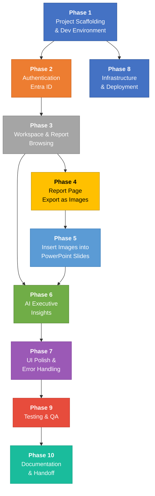
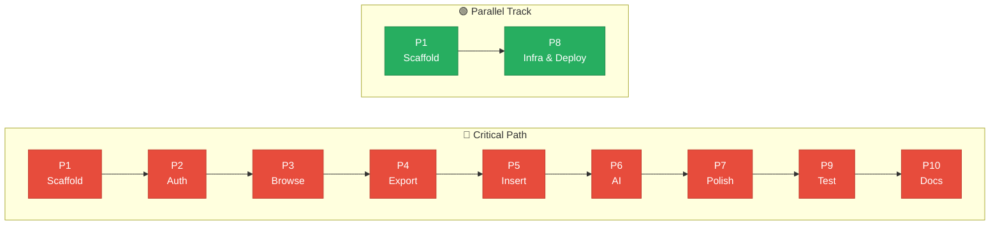
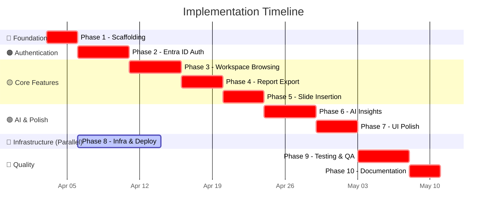
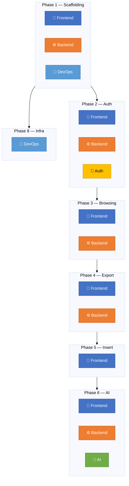

# Task Dependencies — PowerPoint Office Add-in

## Dependency Graph (Mermaid)

## Critical Path vs. Parallel Track

> **Phase 8 (Infrastructure)** can be developed **in parallel** with Phases 2–7, reducing the overall timeline.

## Gantt Chart (Parallel Execution)

> 🔴 `crit` = critical path items &nbsp;|&nbsp; 🔵 `active` = parallel track

## Dependency Matrix

### Role Involvement per Phase

> 🎨 **Blue** = Frontend &nbsp;|&nbsp; ⚙️ **Orange** = Backend &nbsp;|&nbsp; 🔐 **Gold** = Auth &nbsp;|&nbsp; 🧠 **Green** = AI &nbsp;|&nbsp; 🚀 **Light Blue** = DevOps

| Phase | Depends On | Blocks |
|-------|-----------|--------|
| **1 - Scaffolding** | — | 2, 8 |
| **2 - Auth** | 1 | 3 |
| **3 - Browsing** | 2 | 4, 6 |
| **4 - Export** | 3 | 5 |
| **5 - Insert** | 4 | 6 |
| **6 - AI Insights** | 3, 5 | 7 |
| **7 - Polish** | 6 | 9 |
| **8 - Infrastructure** | 1 | — (parallel track) |
| **9 - Testing** | 7 | 10 |
| **10 - Documentation** | 9 | — |
