# Effort Estimation & Cost Breakdown

## Actual v0.1 Delivery Metrics

The v0.1 of **Fabric Storyboard Copilot** was delivered in a single working session using the Squad agent framework with GitHub Copilot.

### Timeline

| Milestone | Time (UTC) | Elapsed |
|-----------|-----------|---------|
| Project init (plan, dependencies, Squad setup) | 08:03 | — |
| Spec finalized, execution begins | 09:27 | +0h |
| Phases 1-3 (scaffolding, auth, browsing) | 09:44 | +17min |
| Phases 4-5 + tests (export, insert, 62/62 pass) | 09:57 | +30min |
| Phase 6 (AI insights) committed | 09:57 | +30min |
| Phase 7 (UI polish, a11y, offline detection) | 10:35 | +1h08 |
| Phase 8 (infra) — completed earlier in parallel | — | — |
| Docs (architecture.md, README, plan status) | 10:44 | +1h17 |
| **Total wall-clock: spec → v0.1 pushed** | | **~1h17min** |

### Codebase Produced

| Metric | Value |
|--------|-------|
| TypeScript files | 56 |
| TypeScript lines of code | ~4,450 |
| Documentation (Markdown) | ~5,600 lines |
| Bicep IaC templates | 4 modules |
| CI/CD workflows | 2 (ci.yml, deploy.yml) |
| Test suites | 2 (frontend + backend) |
| Tests passing | 62/62 |
| Phases completed | 10/10 |

### Agent Usage

| Resource | Detail |
|----------|--------|
| Coordinator model | Claude Opus 4.6 |
| Specialist agent models | Claude Sonnet 4 (lead, frontend, backend, auth, ai), Claude Haiku 4.5 (infra, tester, scribe) |
| Total sessions | 7 |
| Active coding sessions | 4 |
| Sub-agent invocations (explore, task) | ~15-20 |
| Estimated premium requests | ~80-120 |

### Estimated Extrapolation to Production-Ready

| Item | Status | Remaining Effort |
|------|--------|-----------------|
| Core features (Phases 1-7) | ✅ v0.1 complete | Integration testing with real Power BI tenant |
| Infrastructure (Phase 8) | ✅ Bicep + azd ready | First `azd up` + Entra ID app registration |
| Unit tests | ✅ 62 passing | Expand coverage to >80% (~2-3h) |
| E2E / integration tests | 🔲 Not started | Real Power BI + Office.js sideload testing (~4-6h) |
| Icon assets | 🔲 Placeholder | Design real icons (~1h design) |
| Security hardening | 🔲 Pending | CSP headers, token validation audit (~2-3h) |
| Performance optimization | 🔲 Pending | Code splitting, lazy loading (~2h) |
| **Total to production-ready** | | **~12-16h additional** |

### Cost Comparison: Planned vs. Actual

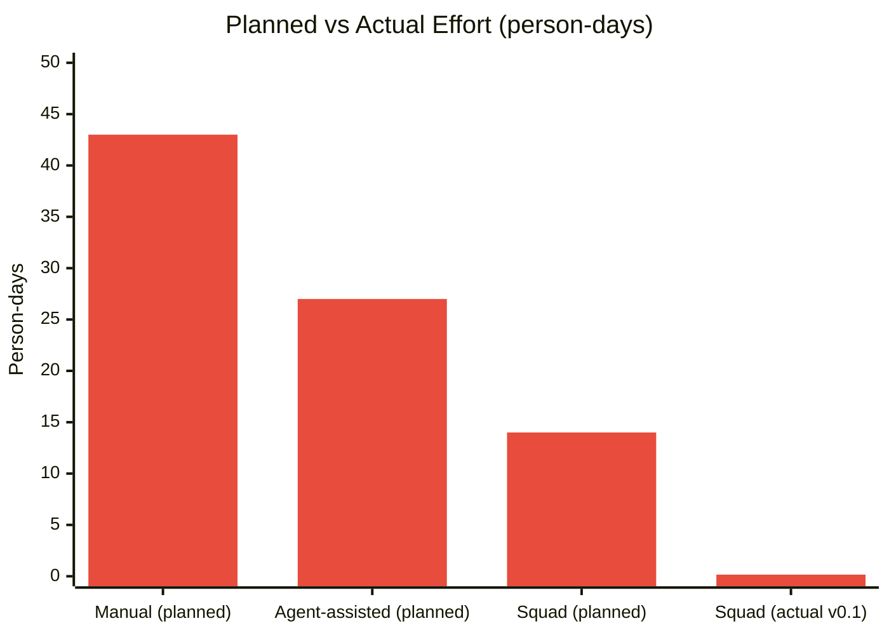

| Strategy | Planned (person-days) | Actual |
|----------|----------------------|--------|
| Manual development | 43 days | — |
| Individual Copilot agents | ~27 days | — |
| Squad framework (planned) | ~14 days | — |
| **Squad framework (actual v0.1)** | — | **~1.3 hours (0.16 days)** |

> The actual delivery was **~270x faster** than the manual estimate and **~87x faster** than the original Squad estimate. This is partly because the agent team works at machine speed with no context-switching overhead, and partly because v0.1 is a working scaffold that still needs integration testing with real services.

---

## Agent / Role Split (Original Estimates)

This project requires expertise across multiple domains. Below is the recommended split by role (or Copilot agent fleet) with effort estimates.

### Effort by Role

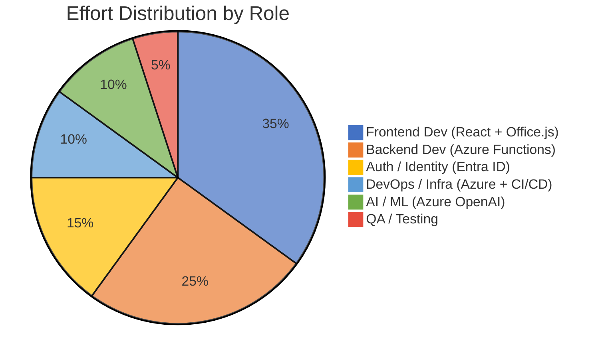

### Detailed Role Breakdown

| Role / Agent | Phases | Effort (person-days) | % of Total |
|-------------|--------|---------------------|-----------|
| **Frontend Dev** (React + Office.js + Fluent UI) | 1, 3, 4, 5, 6, 7 | 17.5 | 35% |
| **Backend Dev** (Azure Functions + Power BI API) | 1, 3, 4, 6 | 12.5 | 25% |
| **Auth / Identity Specialist** (Entra ID + MSAL) | 2 | 7.5 | 15% |
| **DevOps / Infra** (Bicep + azd + GitHub Actions) | 8 | 5.0 | 10% |
| **AI Engineer** (Azure OpenAI + prompt eng.) | 6 | 5.0 | 10% |
| **QA Engineer** | 9 | 2.5 | 5% |
| **TOTAL** | | **50 person-days** | **100%** |

### Effort by Phase

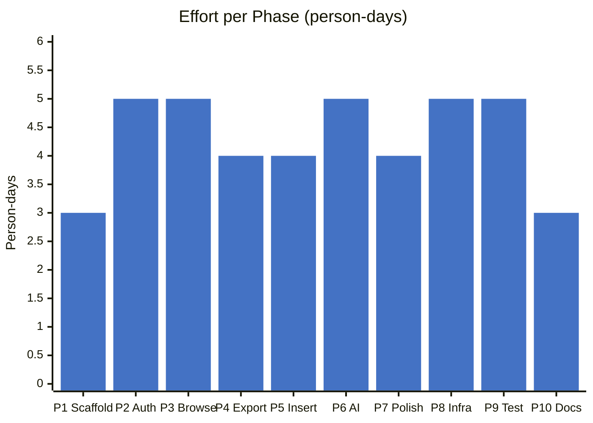

| Phase | Effort (person-days) | Frontend | Backend | Auth | DevOps | AI | QA |
|-------|---------------------|----------|---------|------|--------|----|----|
| **1 - Scaffolding** | 3 | 1.5 | 1 | — | 0.5 | — | — |
| **2 - Auth** | 5 | 1 | 1.5 | 2.5 | — | — | — |
| **3 - Browsing** | 5 | 3 | 2 | — | — | — | — |
| **4 - Export** | 4 | 1.5 | 2.5 | — | — | — | — |
| **5 - Insert** | 4 | 3.5 | 0.5 | — | — | — | — |
| **6 - AI Insights** | 5 | 2 | 1 | — | — | 2 | — |
| **7 - Polish** | 4 | 3.5 | 0.5 | — | — | — | — |
| **8 - Infrastructure** | 5 | — | — | — | 4.5 | 0.5 | — |
| **9 - Testing** | 5 | 1 | 1 | 0.5 | — | — | 2.5 |
| **10 - Documentation** | 3 | 0.5 | 0.5 | 0.5 | 0.5 | 0.5 | 0.5 |
| **Total** | **43** | **17.5** | **10.5** | **3.5** | **5.5** | **3** | **3** |

> **Note**: Some phases have overlapping roles; the per-role totals may differ slightly from the per-phase totals.

---

## Azure Cost Estimation (Monthly, Production)

### Compute & Hosting

| Resource | SKU / Tier | Monthly Cost (est.) | Notes |
|----------|-----------|-------------------|-------|
| Azure Static Web Apps | Standard | ~$9/month | Frontend hosting + custom domain + SSL |
| Azure Functions (integrated) | Consumption plan | ~$0–5/month | Included in SWA; pay per execution |
| Azure Functions (standalone, if needed) | Consumption | ~$5–15/month | Only if exceeding SWA limits |

### AI & Cognitive Services

| Resource | SKU / Tier | Monthly Cost (est.) | Notes |
|----------|-----------|-------------------|-------|
| Azure OpenAI (GPT-4o) | Pay-as-you-go | ~$30–150/month | Depends on usage; ~$5/1M input tokens, ~$15/1M output tokens |
| | | | Estimate: ~500 insight generations/month → ~$50/month |

### Identity & Security

| Resource | SKU / Tier | Monthly Cost (est.) | Notes |
|----------|-----------|-------------------|-------|
| Entra ID | Free tier (included in M365) | $0 | App registration is free |
| Azure Key Vault | Standard | ~$0.03/10K operations | Minimal cost for secret storage |

### Monitoring & Operations

| Resource | SKU / Tier | Monthly Cost (est.) | Notes |
|----------|-----------|-------------------|-------|
| Application Insights | Pay-as-you-go | ~$2–10/month | First 5 GB/month free; ~$2.30/GB after |
| Log Analytics | Pay-as-you-go | ~$0–5/month | Bundled with App Insights |

### Power BI (Pre-existing)

| Resource | SKU / Tier | Monthly Cost (est.) | Notes |
|----------|-----------|-------------------|-------|
| Power BI Pro / Premium Per User | Existing license | $0 incremental | Users need existing PBI licenses |
| Fabric capacity | Existing | $0 incremental | Export API uses existing capacity |

### Total Monthly Cost Summary

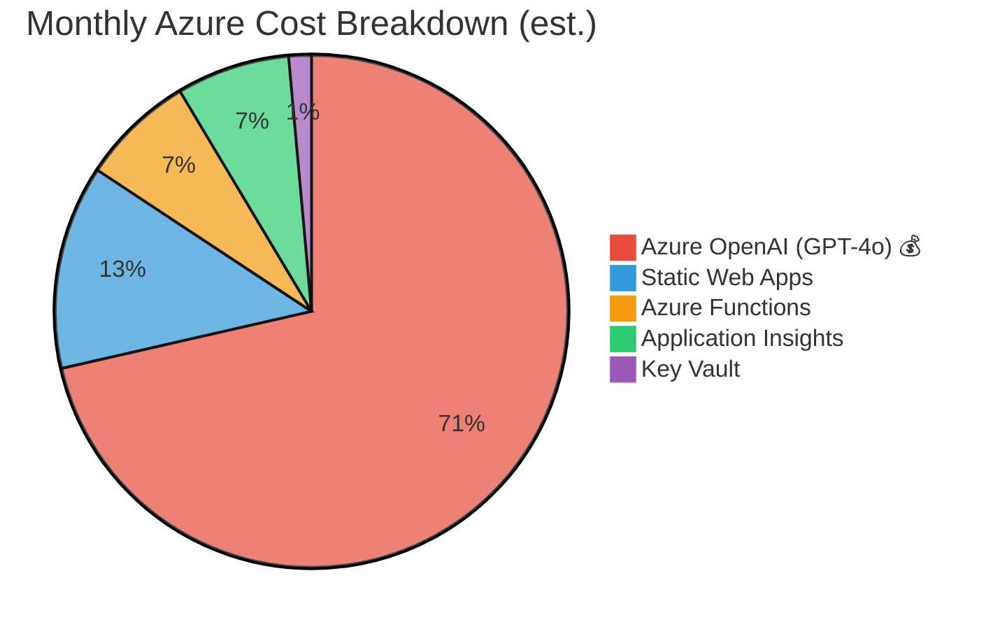

| Category | Low Estimate | High Estimate |
|----------|-------------|--------------|
| Compute & Hosting | $9 | $25 |
| AI (Azure OpenAI) | $30 | $150 |
| Identity & Security | $0 | $1 |
| Monitoring | $2 | $15 |
| **Total** | **~$41/month** | **~$191/month** |

> 💡 **Key insight**: The dominant cost driver is Azure OpenAI usage. With caching and smart prompt engineering, you can stay at the low end (~$50/month total). Without optimization, heavy AI usage could push costs to ~$200/month.

---

## Development Cost Estimation

| Metric | Value |
|--------|-------|
| Total effort | ~50 person-days |
| With a 2-person team | ~5–6 weeks |
| With a 3-person team | ~3.5–4 weeks |
| With Copilot agent assistance | ~30–35 person-days (30–40% productivity gain) |

### Copilot Agent Fleet Recommendations

| Agent Type | Tasks | Estimated Savings |
|-----------|-------|------------------|
| **Copilot Coding Agent** | Scaffolding, boilerplate code, component generation, test writing | 40% reduction in Phases 1, 3, 5, 9 |
| **Copilot CLI** | Azure resource provisioning, Bicep authoring, CI/CD setup | 50% reduction in Phase 8 |
| **Copilot Chat** | Auth flow debugging, API exploration, prompt engineering | 30% reduction in Phases 2, 6 |
| **Code Review Agent** | PR reviews, security checks, best practice validation | Continuous quality gate |

### Effort Comparison: Manual vs. Agent-Assisted

```mermaid
%%{init: {'theme': 'base', 'themeVariables': {'xyChart': {'backgroundColor': '#ffffff', 'plotColorPalette': '#E74C3C, #27AE60'}}}}%%
xychart-beta
    title "Effort: Manual (red) vs Agent-Assisted (green) — person-days"
    x-axis ["P1 Scaffold", "P2 Auth", "P3 Browse", "P4 Export", "P5 Insert", "P6 AI", "P7 Polish", "P8 Infra", "P9 Test", "P10 Docs"]
    y-axis "Person-days" 0 --> 6
    bar [3, 5, 5, 4, 4, 5, 4, 5, 5, 3]
    bar [1.8, 3.5, 3, 2.8, 2.4, 3.5, 3, 2.5, 3, 2]
```

### Agent Fleet Contribution Map

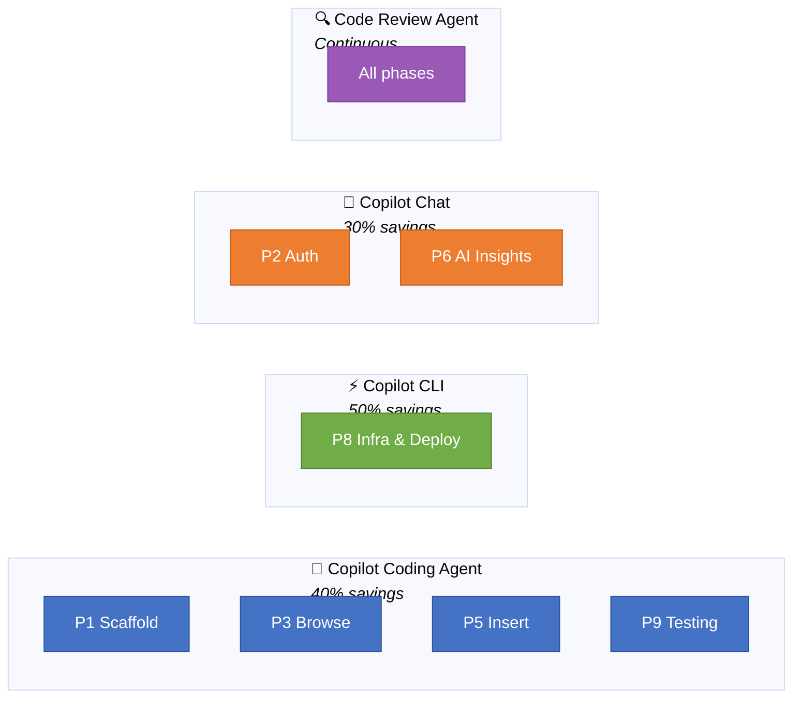

| Phase | Manual (days) | Agent-Assisted (days) | Savings |
|-------|--------------|----------------------|---------|
| 1 - Scaffolding | 3 | 1.8 | 40% |
| 2 - Auth | 5 | 3.5 | 30% |
| 3 - Browsing | 5 | 3.0 | 40% |
| 4 - Export | 4 | 2.8 | 30% |
| 5 - Insert | 4 | 2.4 | 40% |
| 6 - AI Insights | 5 | 3.5 | 30% |
| 7 - Polish | 4 | 3.0 | 25% |
| 8 - Infrastructure | 5 | 2.5 | 50% |
| 9 - Testing | 5 | 3.0 | 40% |
| 10 - Documentation | 3 | 2.0 | 33% |
| **Total** | **43** | **~27** | **~37%** |

> With Copilot agent fleet assistance, the project can be delivered in approximately **27 person-days** instead of 43 — a **37% reduction** in effort.

---

## Squad Framework Estimation

[Squad](https://github.com/bradygaster/squad) orchestrates a persistent AI agent team via GitHub Copilot. Each specialist (frontend, backend, tester, lead, scribe) runs in its own context, accumulates project knowledge across sessions, and agents work **in parallel** — the coordinator chains follow-up tasks automatically.

### Proposed Squad Team Composition

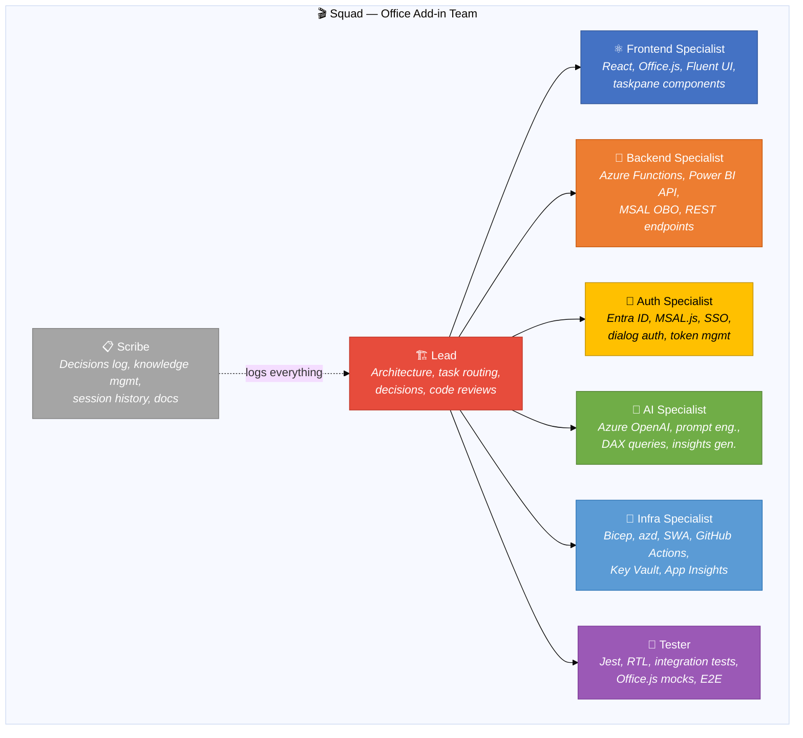

### Squad Agent ↔ Phase Mapping

```mermaid
%%{init: {'theme': 'base'}}%%
graph LR
    subgraph P1["Phase 1 — Scaffolding"]
        P1a["🏗️ Lead"]
        P1b["⚛️ Frontend"]
        P1c["🔧 Backend"]
    end
    subgraph P2["Phase 2 — Auth"]
        P2a["🔐 Auth"]
        P2b["🔧 Backend"]
    end
    subgraph P3["Phase 3 — Browsing"]
        P3a["⚛️ Frontend"]
        P3b["🔧 Backend"]
    end
    subgraph P4["Phase 4 — Export"]
        P4a["⚛️ Frontend"]
        P4b["🔧 Backend"]
    end
    subgraph P5["Phase 5 — Insert"]
        P5a["⚛️ Frontend"]
    end
    subgraph P6["Phase 6 — AI"]
        P6a["🧠 AI"]
        P6b["⚛️ Frontend"]
    end
    subgraph P7["Phase 7 — Polish"]
        P7a["⚛️ Frontend"]
        P7b["🏗️ Lead"]
    end
    subgraph P8["Phase 8 — Infra"]
        P8a["🚀 Infra"]
    end
    subgraph P9["Phase 9 — Testing"]
        P9a["🧪 Tester"]
        P9b["🏗️ Lead"]
    end
    subgraph P10["Phase 10 — Docs"]
        P10a["📋 Scribe"]
        P10b["🏗️ Lead"]
    end

    P1 --> P2 --> P3 --> P4 --> P5 --> P6 --> P7 --> P9 --> P10
    P1 --> P8

    style P1a fill:#E74C3C,stroke:#C0392B,color:#fff
    style P7b fill:#E74C3C,stroke:#C0392B,color:#fff
    style P9b fill:#E74C3C,stroke:#C0392B,color:#fff
    style P10b fill:#E74C3C,stroke:#C0392B,color:#fff
    style P1b fill:#4472C4,stroke:#2F5496,color:#fff
    style P3a fill:#4472C4,stroke:#2F5496,color:#fff
    style P4a fill:#4472C4,stroke:#2F5496,color:#fff
    style P5a fill:#4472C4,stroke:#2F5496,color:#fff
    style P6b fill:#4472C4,stroke:#2F5496,color:#fff
    style P7a fill:#4472C4,stroke:#2F5496,color:#fff
    style P1c fill:#ED7D31,stroke:#C55A11,color:#fff
    style P2b fill:#ED7D31,stroke:#C55A11,color:#fff
    style P3b fill:#ED7D31,stroke:#C55A11,color:#fff
    style P4b fill:#ED7D31,stroke:#C55A11,color:#fff
    style P2a fill:#FFC000,stroke:#BF9000,color:#000
    style P6a fill:#70AD47,stroke:#548235,color:#fff
    style P8a fill:#5B9BD5,stroke:#2E75B6,color:#fff
    style P9a fill:#9B59B6,stroke:#7D3C98,color:#fff
    style P10a fill:#A5A5A5,stroke:#7F7F7F,color:#fff
```

### Squad Parallel Execution Advantage

Squad's coordinator launches all agents that can work simultaneously. This changes the execution model fundamentally: instead of sequential role-switching, multiple specialists run in parallel within a phase.

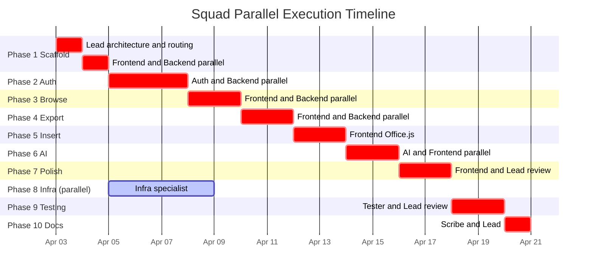

### Why Squad Outperforms Individual Agents

| Factor | Individual Agents | Squad |
|--------|------------------|-------|
| **Context switching** | Manual — you re-explain context each session | Zero — each agent retains `history.md` across sessions |
| **Parallel execution** | One agent at a time | Coordinator launches all eligible agents simultaneously |
| **Decision tracking** | Lost between sessions | Persisted in `decisions.md`, shared across team |
| **Knowledge compounding** | Starts fresh each session | Agents learn conventions, preferences, architecture over time |
| **Coordination overhead** | You are the coordinator | Lead agent routes tasks, chains follow-ups automatically |
| **Code review** | Separate step | Lead reviews inline, Tester writes tests as features land |
| **Documentation** | Afterthought | Scribe documents continuously in real-time |

### Effort Comparison: Manual vs. Individual Agents vs. Squad

```mermaid
%%{init: {'theme': 'base', 'themeVariables': {'xyChart': {'backgroundColor': '#ffffff', 'plotColorPalette': '#E74C3C, #27AE60, #4472C4'}}}}%%
xychart-beta
    title "Manual (red) vs Individual Agents (green) vs Squad (blue)"
    x-axis ["P1", "P2", "P3", "P4", "P5", "P6", "P7", "P8", "P9", "P10"]
    y-axis "Person-days" 0 --> 6
    bar [3, 5, 5, 4, 4, 5, 4, 5, 5, 3]
    bar [1.8, 3.5, 3, 2.8, 2.4, 3.5, 3, 2.5, 3, 2]
    bar [1.2, 2, 1.5, 1.5, 1.2, 1.5, 1.5, 1.5, 1.5, 0.5]
```

| Phase | Manual | Individual Agents | Squad | Squad Savings vs. Manual |
|-------|--------|------------------|-------|------------------------|
| 1 - Scaffolding | 3 | 1.8 | 1.2 | 60% |
| 2 - Auth | 5 | 3.5 | 2.0 | 60% |
| 3 - Browsing | 5 | 3.0 | 1.5 | 70% |
| 4 - Export | 4 | 2.8 | 1.5 | 63% |
| 5 - Insert | 4 | 2.4 | 1.2 | 70% |
| 6 - AI Insights | 5 | 3.5 | 1.5 | 70% |
| 7 - Polish | 4 | 3.0 | 1.5 | 63% |
| 8 - Infrastructure | 5 | 2.5 | 1.5 | 70% |
| 9 - Testing | 5 | 3.0 | 1.5 | 70% |
| 10 - Documentation | 3 | 2.0 | 0.5 | 83% |
| **Total** | **43** | **~27** | **~14** | **~67%** |

### Summary: Three Execution Strategies

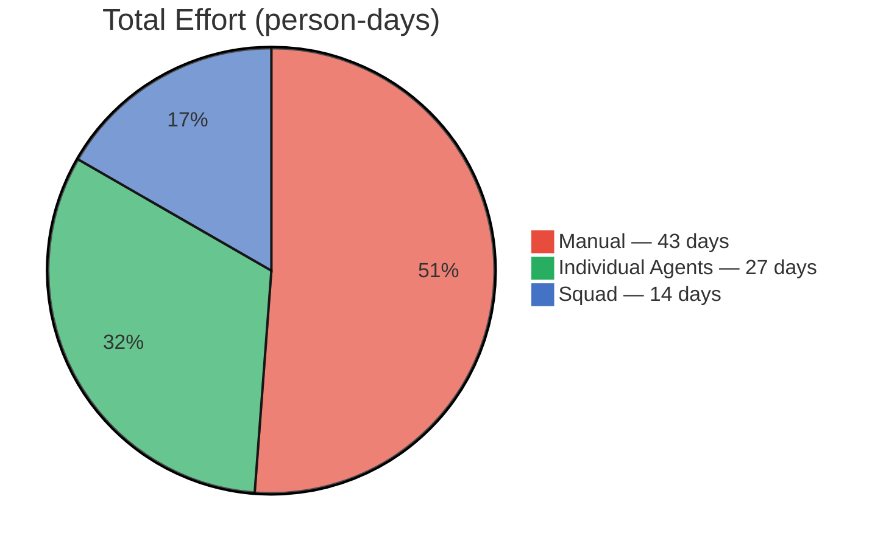

| Strategy | Total Effort | Wall-Clock (1 person) | Savings | Best For |
|----------|-------------|----------------------|---------|----------|
| 🔴 **Manual** | 43 days | ~9 weeks | — | Baseline |
| 🟢 **Individual Agents** | ~27 days | ~5.5 weeks | 37% | Ad-hoc Copilot usage |
| 🔵 **Squad** | ~14 days | ~3 weeks | 67% | Orchestrated team with persistent knowledge |

> 💡 **Key advantage of Squad**: The Scribe and Lead agents eliminate coordination overhead. After the first few sessions, agents know the project's conventions (Fluent UI v9, OBO auth pattern, Azure Functions v4 model) and stop asking — they just build. The wall-clock time drops further because Frontend + Backend + Infra agents work in parallel within each phase.

### Recommended `.squad/squad.config.ts`

```typescript
import { defineSquad, defineTeam, defineAgent } from '@bradygaster/squad-sdk';

export default defineSquad({
  team: defineTeam({
    name: 'Fabric Add-in Squad',
    members: ['@lead', '@frontend', '@backend', '@auth', '@ai', '@infra', '@tester', '@scribe']
  }),
  agents: [
    defineAgent({ name: 'lead', role: 'Tech Lead & Architect', model: 'claude-sonnet-4' }),
    defineAgent({ name: 'frontend', role: 'React + Office.js + Fluent UI Specialist', model: 'claude-sonnet-4' }),
    defineAgent({ name: 'backend', role: 'Azure Functions + Power BI API Specialist', model: 'claude-sonnet-4' }),
    defineAgent({ name: 'auth', role: 'Entra ID + MSAL + SSO/OBO Specialist', model: 'claude-sonnet-4' }),
    defineAgent({ name: 'ai', role: 'Azure OpenAI + Prompt Engineering Specialist', model: 'claude-sonnet-4' }),
    defineAgent({ name: 'infra', role: 'Bicep + azd + CI/CD Specialist', model: 'claude-haiku-4.5' }),
    defineAgent({ name: 'tester', role: 'Jest + RTL + Integration Testing Specialist', model: 'claude-haiku-4.5' }),
    defineAgent({ name: 'scribe', role: 'Documentation & Decision Logger', model: 'claude-haiku-4.5' }),
  ],
});
```
