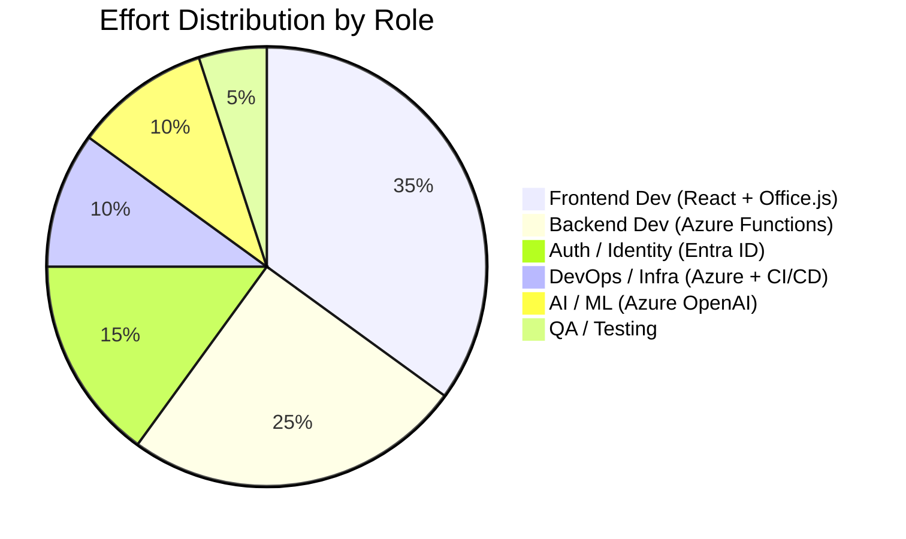
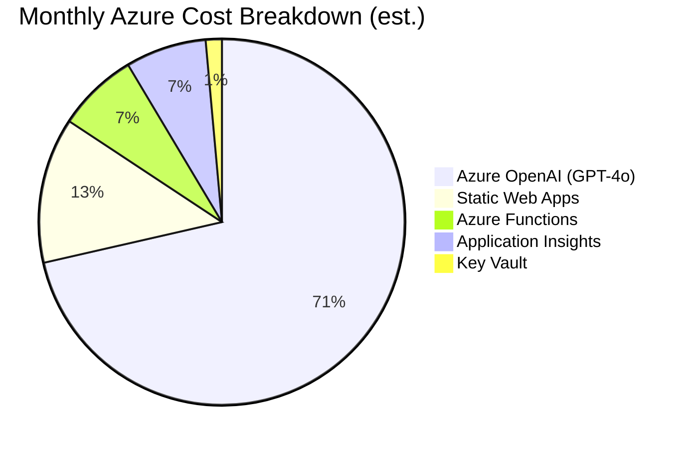

# Effort Estimation & Cost Breakdown

## Agent / Role Split

This project requires expertise across multiple domains. Below is the recommended split by role (or Copilot agent fleet) with effort estimates.

### Effort by Role



### Detailed Role Breakdown

| Role / Agent | Phases | Effort (person-days) | % of Total |
|-------------|--------|---------------------|-----------|
| **Frontend Dev** (React + Office.js + Fluent UI) | 1, 3, 4, 5, 6, 7 | 17.5 | 35% |
| **Backend Dev** (Azure Functions + Power BI API) | 1, 3, 4, 6 | 12.5 | 25% |
| **Auth / Identity Specialist** (Entra ID + MSAL) | 2 | 7.5 | 15% |
| **DevOps / Infra** (Bicep + azd + GitHub Actions) | 8 | 5.0 | 10% |
| **AI Engineer** (Azure OpenAI + prompt eng.) | 6 | 5.0 | 10% |
| **QA Engineer** | 9 | 2.5 | 5% |
| **TOTAL** | | **50 person-days** | **100%** |

### Effort by Phase

```mermaid
bar
    title Effort per Phase (person-days)
```

| Phase | Effort (person-days) | Frontend | Backend | Auth | DevOps | AI | QA |
|-------|---------------------|----------|---------|------|--------|----|----|
| **1 - Scaffolding** | 3 | 1.5 | 1 | — | 0.5 | — | — |
| **2 - Auth** | 5 | 1 | 1.5 | 2.5 | — | — | — |
| **3 - Browsing** | 5 | 3 | 2 | — | — | — | — |
| **4 - Export** | 4 | 1.5 | 2.5 | — | — | — | — |
| **5 - Insert** | 4 | 3.5 | 0.5 | — | — | — | — |
| **6 - AI Insights** | 5 | 2 | 1 | — | — | 2 | — |
| **7 - Polish** | 4 | 3.5 | 0.5 | — | — | — | — |
| **8 - Infrastructure** | 5 | — | — | — | 4.5 | 0.5 | — |
| **9 - Testing** | 5 | 1 | 1 | 0.5 | — | — | 2.5 |
| **10 - Documentation** | 3 | 0.5 | 0.5 | 0.5 | 0.5 | 0.5 | 0.5 |
| **Total** | **43** | **17.5** | **10.5** | **3.5** | **5.5** | **3** | **3** |

> **Note**: Some phases have overlapping roles; the per-role totals may differ slightly from the per-phase totals.

---

## Azure Cost Estimation (Monthly, Production)

### Compute & Hosting

| Resource | SKU / Tier | Monthly Cost (est.) | Notes |
|----------|-----------|-------------------|-------|
| Azure Static Web Apps | Standard | ~$9/month | Frontend hosting + custom domain + SSL |
| Azure Functions (integrated) | Consumption plan | ~$0–5/month | Included in SWA; pay per execution |
| Azure Functions (standalone, if needed) | Consumption | ~$5–15/month | Only if exceeding SWA limits |

### AI & Cognitive Services

| Resource | SKU / Tier | Monthly Cost (est.) | Notes |
|----------|-----------|-------------------|-------|
| Azure OpenAI (GPT-4o) | Pay-as-you-go | ~$30–150/month | Depends on usage; ~$5/1M input tokens, ~$15/1M output tokens |
| | | | Estimate: ~500 insight generations/month → ~$50/month |

### Identity & Security

| Resource | SKU / Tier | Monthly Cost (est.) | Notes |
|----------|-----------|-------------------|-------|
| Entra ID | Free tier (included in M365) | $0 | App registration is free |
| Azure Key Vault | Standard | ~$0.03/10K operations | Minimal cost for secret storage |

### Monitoring & Operations

| Resource | SKU / Tier | Monthly Cost (est.) | Notes |
|----------|-----------|-------------------|-------|
| Application Insights | Pay-as-you-go | ~$2–10/month | First 5 GB/month free; ~$2.30/GB after |
| Log Analytics | Pay-as-you-go | ~$0–5/month | Bundled with App Insights |

### Power BI (Pre-existing)

| Resource | SKU / Tier | Monthly Cost (est.) | Notes |
|----------|-----------|-------------------|-------|
| Power BI Pro / Premium Per User | Existing license | $0 incremental | Users need existing PBI licenses |
| Fabric capacity | Existing | $0 incremental | Export API uses existing capacity |

### Total Monthly Cost Summary



| Category | Low Estimate | High Estimate |
|----------|-------------|--------------|
| Compute & Hosting | $9 | $25 |
| AI (Azure OpenAI) | $30 | $150 |
| Identity & Security | $0 | $1 |
| Monitoring | $2 | $15 |
| **Total** | **~$41/month** | **~$191/month** |

> 💡 **Key insight**: The dominant cost driver is Azure OpenAI usage. With caching and smart prompt engineering, you can stay at the low end (~$50/month total). Without optimization, heavy AI usage could push costs to ~$200/month.

---

## Development Cost Estimation

| Metric | Value |
|--------|-------|
| Total effort | ~50 person-days |
| With a 2-person team | ~5–6 weeks |
| With a 3-person team | ~3.5–4 weeks |
| With Copilot agent assistance | ~30–35 person-days (30–40% productivity gain) |

### Copilot Agent Fleet Recommendations

| Agent Type | Tasks | Estimated Savings |
|-----------|-------|------------------|
| **Copilot Coding Agent** | Scaffolding, boilerplate code, component generation, test writing | 40% reduction in Phases 1, 3, 5, 9 |
| **Copilot CLI** | Azure resource provisioning, Bicep authoring, CI/CD setup | 50% reduction in Phase 8 |
| **Copilot Chat** | Auth flow debugging, API exploration, prompt engineering | 30% reduction in Phases 2, 6 |
| **Code Review Agent** | PR reviews, security checks, best practice validation | Continuous quality gate |

### Effort Comparison: Manual vs. Agent-Assisted

```mermaid
xychart-beta
    title "Effort: Manual vs Agent-Assisted (person-days)"
    x-axis ["P1", "P2", "P3", "P4", "P5", "P6", "P7", "P8", "P9", "P10"]
    y-axis "Person-days" 0 --> 6
    bar [3, 5, 5, 4, 4, 5, 4, 5, 5, 3]
    bar [1.8, 3.5, 3, 2.8, 2.4, 3.5, 3, 2.5, 3, 2]
```



| Phase | Manual (days) | Agent-Assisted (days) | Savings |
|-------|--------------|----------------------|---------|
| 1 - Scaffolding | 3 | 1.8 | 40% |
| 2 - Auth | 5 | 3.5 | 30% |
| 3 - Browsing | 5 | 3.0 | 40% |
| 4 - Export | 4 | 2.8 | 30% |
| 5 - Insert | 4 | 2.4 | 40% |
| 6 - AI Insights | 5 | 3.5 | 30% |
| 7 - Polish | 4 | 3.0 | 25% |
| 8 - Infrastructure | 5 | 2.5 | 50% |
| 9 - Testing | 5 | 3.0 | 40% |
| 10 - Documentation | 3 | 2.0 | 33% |
| **Total** | **43** | **~27** | **~37%** |

> With Copilot agent fleet assistance, the project can be delivered in approximately **27 person-days** instead of 43 — a **37% reduction** in effort.
