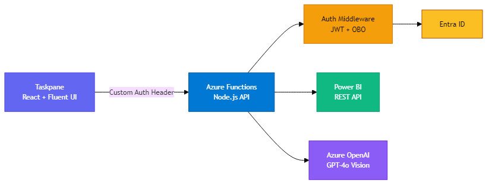
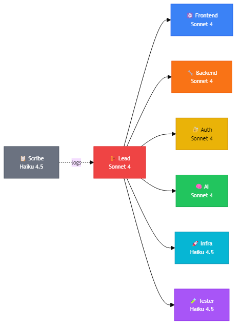
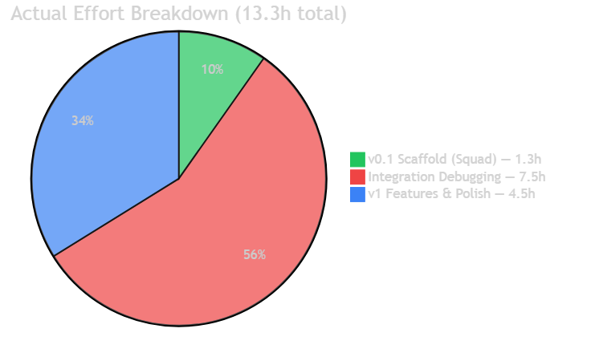
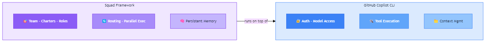
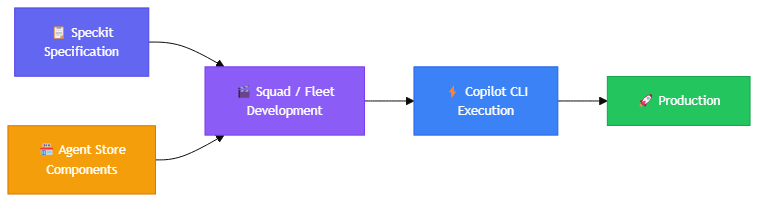
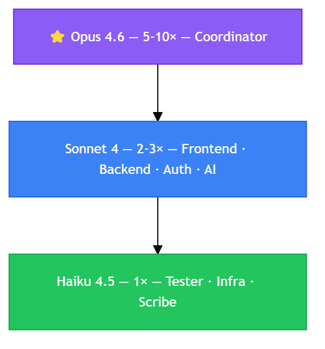

<!-- _class: cover -->
<!-- _paginate: false -->

# Fabric Storyboard Copilot

## From 43 Man-Days to 13 Hours with AI Agents
### How AI-Powered Development Transforms Software Delivery

---

<!-- _class: divider -->
<!-- _paginate: false -->

# 01 — The Project
## What we built and why it matters

---

# Fabric Storyboard Copilot

A **PowerPoint Office Add-in** connecting Microsoft Fabric & Power BI to slide authoring

### What it does
- 🔐 **Entra ID** authentication (SSO + OBO flow)
- 📊 Browse workspaces, reports & pages
- 📸 Export report pages as **PNG**
- 🖼️ Insert images into slides via **Office.js**
- 🧠 AI-powered insights with **GPT-4o Vision**
- ✨ One-click: image + insights on current slide

### Tech Stack
- **Frontend** — React 18 + Fluent UI v9
- **Backend** — Azure Functions (Node.js 18)
- **Hosting** — Azure Static Web Apps
- **AI** — Azure OpenAI GPT-4o Vision
- **Auth** — MSAL.js 2.x + Entra ID
- **IaC** — Bicep + azd + GitHub Actions

---

# The Taskpane Experience

*Workspace browser • breadcrumb navigation • PNG export • layout options • AI insights*

---

# Insert Page with Insights

*One-click result: chart image (60%) + GPT-4o Vision insights (40%) on the same slide*

---

# Complete Workflow

*6 slides populated from Retail Analysis — image export + AI executive insights side-by-side*

---

# Architecture

| Layer | Technology | Role |
|-------|-----------|------|
| **Frontend** | React 18 + Fluent UI v9 | Taskpane inside PowerPoint |
| **Backend** | Azure Functions (Node.js 18) | API proxy with auth |
| **Auth** | MSAL.js → Entra ID → OBO | SSO + delegated token flow |
| **AI** | Azure OpenAI GPT-4o Vision | Analyze exported report images |
| **Hosting** | Azure Static Web Apps | Frontend + integrated Functions |
| **IaC** | Bicep + azd + GitHub Actions | Infrastructure as code + CI/CD |

---

<!-- _class: divider -->
<!-- _paginate: false -->

# 02 — How We Built It
## Squad, Copilot CLI, and the real numbers

---

# The Challenge: Traditional Estimation

A project estimated at **43 man-days** using conventional development

| Phase | Scope | Manual Effort |
|-------|-------|:---:|
| 1 — Scaffolding | Project setup, deps, config | 3 days |
| 2 — Authentication | Entra ID, MSAL, SSO, OBO | 5 days |
| 3 — Workspace Browsing | API + React tree components | 5 days |
| 4 — Export | Power BI ExportToFile → PNG | 4 days |
| 5 — Insert | Office.js slide manipulation | 4 days |
| 6 — AI Insights | Azure OpenAI, prompt eng. | 5 days |
| 7 — UI Polish | Fluent UI, a11y, UX | 4 days |
| 8 — Infrastructure | Bicep, CI/CD, SWA, Key Vault | 5 days |
| 9 — Testing | Jest, mocks, integration | 5 days |
| 10 — Documentation | Architecture, API docs | 3 days |
| **Total** | | **43 days** |

---

# What is Squad?

> *"All of us are going to be managers of infinite minds."*
> — Satya Nadella, WEF Davos, January 2026

**Squad** is a persistent AI agent team framework built on GitHub Copilot CLI

### What it is
- ✅ Your **AI team** with defined roles & charters
- ✅ Agents with memory, expertise, decision authority
- ✅ **Parallel** coordinated execution
- ✅ Persistent knowledge across sessions
- ✅ Built by Brady Gaster (Microsoft)

### What it's not
- ❌ Not a replacement for human judgment
- ❌ Not magic — works with what you give it
- ❌ Not a raw content generator
- ❌ Not a CI/CD pipeline

*Squad follows rules. If something isn't clear, it stops and asks.*

---

# Our Squad: 8 Specialized Agents

| Agent | Model | Role | Agent | Model | Role |
|-------|-------|------|-------|-------|------|
| 🏗️ **Lead** | Sonnet 4 | Architecture & routing | 🧠 **AI** | Sonnet 4 | Prompt engineering |
| ⚛️ **Frontend** | Sonnet 4 | React, Office.js | 🚀 **Infra** | Haiku 4.5 | Bicep, SWA, CI/CD |
| 🔧 **Backend** | Sonnet 4 | Functions, REST API | 🧪 **Tester** | Haiku 4.5 | Jest, mocks |
| 🔐 **Auth** | Sonnet 4 | Entra ID, MSAL, OBO | 📋 **Scribe** | Haiku 4.5 | Docs & decision log |

---

# Distinct LLM Models Per Agent Role

Each agent gets the **right model** for its job — not one-size-fits-all

| Tier | Model | Cost | Agents | Rationale |
|:---:|-------|:---:|--------|-----------|
| 🟣 **Premium** | Claude Opus 4.6 | 5-10× | Coordinator | Strategic orchestration, complex decisions |
| 🔵 **Standard** | Claude Sonnet 4 | 2-3× | Lead, Frontend, Backend, Auth, AI | Complex code, deep reasoning |
| 🟢 **Fast** | Claude Haiku 4.5 | 1× | Infra, Tester, Scribe | Structured tasks, cost-optimized |

### Why this matters

> Using Opus for everything would cost **5-10×** more with no quality gain on test writing.
> Using Haiku for architecture decisions would save money but **miss critical design issues**.

**Principle**: Use the **cheapest model capable** of doing the job well.

---

# Squad × Phases: Parallel Execution

| Phase | Agents | Parallel |
|-------|--------|:---:|
| P1 — Scaffolding | 🏗️ Lead + ⚛️ Frontend + 🔧 Backend | ✅ |
| P2 — Auth | 🔐 Auth + 🔧 Backend | ✅ |
| P3 — Browse | ⚛️ Frontend + 🔧 Backend | ✅ |
| P4 — Export | ⚛️ Frontend + 🔧 Backend | ✅ |
| P5 — Insert | ⚛️ Frontend | — |
| P6 — AI | 🧠 AI + ⚛️ Frontend | ✅ |
| P7 — Polish | ⚛️ Frontend + 🏗️ Lead | ✅ |
| P8 — Infra | 🚀 Infra *(runs in parallel from P1)* | ✅ |
| P9 — Testing | 🧪 Tester + 🏗️ Lead | ✅ |
| P10 — Docs | 📋 Scribe + 🏗️ Lead | ✅ |

> Infrastructure (P8) runs **in parallel** with all other phases from the start
> Multiple agents work **simultaneously** within each phase

---

# v0.1 Timeline: Scaffold in 77 Minutes

| Milestone | Elapsed |
|-----------|:---:|
| Project init — plan, dependencies, Squad setup | 0h |
| Spec finalized, execution begins | +0h |
| **Phases 1-3** — scaffolding, auth, browsing | **+17 min** |
| **Phases 4-5** + 62 tests — export, insert | **+30 min** |
| **Phase 6** — AI insights | **+30 min** |
| **Phase 7** — UI polish, a11y | **+1h 08** |
| **Phase 8** — infrastructure (in parallel) | *concurrent* |
| **Phase 10** — documentation | **+1h 17** |
| 🎯 **v0.1 scaffold complete** | **~1h 17min** |

### What was produced

| Metric | Value |
|--------|-------|
| TypeScript files | **57** |
| Lines of code | **~5,351** |
| Passing tests | **62/62** |
| Phases completed | **10/10** |

---

# Post-v0.1: The Real Integration Work

> Agent-generated scaffolds are **~90% correct**. The remaining 10% — auth tokens, API formats, cloud platform quirks — requires iterative debugging with real services.

| Issue | Root Cause | Time |
|-------|-----------|:---:|
| SWA Key Vault | SWA doesn't support `@Microsoft.KeyVault()` refs | ~1h |
| Export 400 | JPEG is not a valid Power BI ExportToFile format | ~30m |
| Export 403 | Wrong endpoint: My Workspace vs `/groups/{id}/` | ~1h |
| Auth header hijack | SWA overwrites `Authorization` → custom header | ~1h |
| JWT verification | Needed `jsonwebtoken` + `jwks-rsa` for JWKS | ~1h |
| OpenAI 404 | Double path `/openai/v1/` in endpoint | ~15m |
| Entra consent | Missing `user_impersonation` scope | ~30m |
| UI redesign | Fluent UI v9 branded header, cards, icons | ~2h |
| **Total integration** | | **~7.5h** |

---

# v1 Features & Polish

Built with **GitHub Copilot CLI** (Claude Opus 4.6) after the Squad scaffold

| Feature | Description | Time |
|---------|------------|:---:|
| 🧠 GPT-4o Vision | Analyze exported report *images* for visual insights | ~1.5h |
| 🔧 Combined Insert | Fix GeneralException, `goToByIdAsync` in PPT Online | ~2h |
| 🎨 UI Polish | Colored headers, card sections, Sparkle/Lightbulb icons | ~1h |
| **Total v1 features** | | **~4.5h** |

### Final v1 Codebase

| Metric | Value |
|--------|-------|
| TypeScript files | **57** |
| Lines of TypeScript | **~5,351** |
| Tests passing | **68/68** (23 frontend + 45 backend) |
| Deployed to | **Azure Static Web Apps** (production) |

---

<!-- _class: dark -->

# 📊 The Result: 43 Days → 13.3 Hours

### Effort Breakdown

| Phase | Duration | Tool |
|-------|:---:|------|
| 🟢 v0.1 scaffold | **1.3h** | Squad (8 agents) |
| 🔴 Integration | **7.5h** | Copilot CLI |
| 🔵 v1 features | **4.5h** | Copilot CLI |
| **Total** | **13.3h** | |

### Strategy Comparison

| Strategy | Effort | Speed-up |
|----------|:---:|:---:|
| 🔴 Manual dev | 43 days | — |
| 🟡 Individual agents | ~27 days | 37% less |
| 🔵 Squad (planned) | ~14 days | 67% less |
| **🟢 Squad + CLI (actual)** | **1.66 days** | **~26×** |

---

# Phase-by-Phase Comparison

| Phase | Manual | Agents | Squad | Squad Savings |
|-------|:---:|:---:|:---:|:---:|
| Scaffolding | 3 | 1.8 | 1.2 | **60%** |
| Authentication | 5 | 3.5 | 2.0 | **60%** |
| Browsing | 5 | 3.0 | 1.5 | **70%** |
| Export | 4 | 2.8 | 1.5 | **63%** |
| Insert | 4 | 2.4 | 1.2 | **70%** |
| AI Insights | 5 | 3.5 | 1.5 | **70%** |
| UI Polish | 4 | 3.0 | 1.5 | **63%** |
| Infrastructure | 5 | 2.5 | 1.5 | **70%** |
| Testing | 5 | 3.0 | 1.5 | **70%** |
| Documentation | 3 | 2.0 | 0.5 | **83%** |
| **Total** | **43** | **~27** | **~14** | **~67%** |

> Planned Squad: 14 days — **Actual**: 1.66 days → **8.5× faster than plan**

---

<!-- _class: accent -->
<!-- _paginate: false -->

# 💡 Key Learning

### The scaffold is ~90% correct
### The last 10% — auth, API formats, cloud quirks — needs iterative debugging

### Total effort: zero → v1 deployed = **~13.3 hours**
### Manual estimate: **43 man-days**
### Real acceleration: **~26×**

---

<!-- _class: divider -->
<!-- _paginate: false -->

# 03 — The Tooling Ecosystem
## Copilot CLI · Squad · Agent Store · Speckit

---

# GitHub Copilot CLI: The Foundation

**Copilot CLI** is the platform layer — authentication, model access, tool execution

### Capabilities
- 📝 Edits code via file operations
- 🔨 Runs builds, tests, deployments
- 🔀 Manages git commits & pushes
- ☁️ Deploys to Azure (SWA CLI)
- 🐛 Iterative debug: read error → fix → retest

### On this project
- **Model**: Claude Opus 4.6
- **Role**: All post-v0.1 work
- Integration debugging (7.5h)
- GPT-4o Vision integration
- UI polish iterations
- Office.js compatibility fixes
- Production deployment

> *"Copilot CLI is the foundation. Squad runs **on top of** Copilot CLI."* — Dina Berry

---

# Copilot CLI + Squad: Complementary, Not Competing

| | Copilot CLI | Squad |
|---|---|---|
| **Nature** | Platform / Runtime | Orchestration Framework |
| **Agents** | Single agent | Team of specialists |
| **Memory** | Session only | Persistent (`decisions.md`, `history.md`) |
| **Coordination** | Manual (you direct) | Automatic (Lead routes tasks) |

> *"People often assume they're competing tools. They're not."* — Dina Berry

---

# Fleet vs Squad: When to Use Which

| Criteria | Copilot Fleet | Squad |
|----------|:---:|:---:|
| **Agents** | Multiple, ad-hoc | Structured persistent team |
| **Shared context** | ❌ Resets between sessions | ✅ `decisions.md` shared |
| **Specialization** | Generalists | Deep domain charters |
| **Parallelism** | One agent at a time | Coordinator fans out |
| **Knowledge compounding** | Starts fresh | Improves over time |
| **Coordination** | You are the coordinator | Lead auto-routes |
| **Documentation** | Afterthought | Scribe logs continuously |

### Why we chose Squad for this project

✅ **Multi-domain** — Auth + Power BI + Office.js + AI + Infra all at once
✅ **Real parallelism** — Frontend + Backend + Infra agents work simultaneously
✅ **Deep specialization** — Each agent carries domain expertise in its charter

---

# Agents vs Skills in Squad

### 🤖 Agent (10%) — Actor
- Has a **charter** and domain expertise
- Makes **decisions** autonomously
- Uses any available tools
- Works until completion
- **When?** Expertise + analysis + judgment

### ⚙️ Skill (90%) — Action
- A **list of steps** to execute
- Any agent can use any skill
- Scoped and deterministic
- Reusable and improvable
- **When?** Repetitive, structured tasks

> **Routing**: the coordinator scans **all skills** before spawning agents
> Relevant skills are injected into the agent's context
> No matching skill? The agent works normally

*Skills are shared knowledge — not owned by any agent. Investment is transferable because everything is markdown.*

---

# Scaling Squad: A Trust Progression

> *"Autonomy is not a switch — it's a progression. You earn it."* — Tamir Dresher

| Level | Mode | Human Role | Squad Role |
|:---:|------|-----|-------|
| 1 | **Observe** | Full control | Watches, learns patterns |
| 2 | **Assist** | Makes decisions | Drafts PRs, analyses |
| 3 | **Act** | Sets guardrails | Executes bounded tasks |
| 4 | **Coordinate** | Defines intent | Links PRs ↔ issues, routes work |
| 5 | **Autonomize** | Sets goals | End-to-end execution |

---

# Speckit: The Spec-First Paradigm

The real paradigm shift: from **code-first** to **specification-first**

### 🔴 Traditional
1. Scoping meeting
2. Write specs (days/weeks)
3. Development (weeks/months)
4. Testing
5. Deployment
6. Documentation

*Spec is throwaway. Code is the deliverable.*

### 🟢 Speckit Approach
1. **Write the spec** (structured markdown)
2. **Agent generates** the full codebase
3. Debug & integration
4. Deployed ✅

*Spec IS the deliverable. Code is a derived artifact.*

> With Speckit, human value focuses on the **what**, not the **how**
> The agent handles implementation — humans bring **domain expertise**

---

# Agent Store: The Marketplace

Pre-built agents for common domains — ready to integrate into Squad or Fleet

### Concept
- 🏪 Agents packaged by domain
- 🔌 Plug into Squad or Fleet
- ⚙️ Configurable with custom skills
- 🌐 Community marketplace

### Example Agents
- 🔐 **Auth Agent** — Entra ID, OAuth, MSAL
- 📊 **Power BI Agent** — REST API, DAX
- 🎨 **Fluent UI Agent** — React components
- 🚀 **Azure Deploy** — Bicep, SWA, ACA
- 🧪 **Testing Agent** — Jest, mocks, E2E

> Each Agent Store agent has its **optimal LLM model**
> A testing agent doesn't need Opus — Haiku is enough
> An architecture agent needs deep reasoning → Sonnet or Opus

---

# The Complete Toolchain

| Tool | Role | When |
|------|------|------|
| **Speckit** | Define *what* to build (structured markdown) | Start of project |
| **Agent Store** | Reusable pre-built domain agents | Agent selection |
| **Squad** | Orchestrated team execution | Scaffolding & features |
| **Copilot CLI** | Single-agent execution platform | Integration & debugging |
| **Fleet** | Multiple ad-hoc agents | Quick tasks, exploration |

---

<!-- _class: divider -->
<!-- _paginate: false -->

# 04 — The Cost Model
## Premium requests and LLM optimization

---

# Premium Requests: The New Currency

Every agent interaction consumes **premium requests** — the cost unit of AI development

| Model | Relative Cost | Best For |
|-------|:---:|---------|
| Claude Haiku 4.5 / GPT-4.1 | **1×** | Structured tasks, formatting, scripting |
| Claude Sonnet 4 | **2-3×** | Complex code, reasoning, reviews |
| Claude Opus 4.6 | **5-10×** | Orchestration, architecture, strategic decisions |

### Our Project Consumption

| Resource | Detail | Est. Requests |
|----------|--------|:---:|
| Coordinator (Opus) | Orchestration, routing | ~20-30 |
| 5× Sonnet agents (Lead, FE, BE, Auth, AI) | Code generation, reviews | ~40-60 |
| 3× Haiku agents (Infra, Test, Scribe) | IaC, tests, docs | ~20-30 |
| **Total estimated** | | **~80-120** |

---

# Cost Optimization: Right Model, Right Job

| Tier | Model | Cost | Use For |
|:---:|-------|:---:|---------|
| 🟣 Premium | Claude Opus 4.6 | 5-10× | Strategic orchestration, architecture |
| 🔵 Standard | Claude Sonnet 4 | 2-3× | Complex code, deep reasoning |
| 🟢 Fast | Claude Haiku 4.5 | 1× | Structured tasks, tests, docs |

> **Principle**: use the cheapest model **capable** of doing the job well
> Using Opus everywhere = **5-10× cost** with no gain on test writing
> Using Haiku for architecture = save money but **miss critical issues**

---

# Project Cost: Agents vs Humans

| | Manual Development | With AI Agents |
|---|:---:|:---:|
| **Effort** | 43 man-days | 13.3 hours |
| **Human cost** (@$700/day) | **$30,100** | **~$1,400** (2 days) |
| **Agent cost** (premium requests) | $0 | **~$50-100** |
| **Azure monthly** | ~$70/mo | ~$70/mo |
| **Total (first year)** | **~$31,000** | **~$2,340** |
| **Time to delivery** | ~9 weeks | **~2 days** |

> **Savings**: ~$28,700 and 8.5 weeks on a **single project**
> Agent cost is **negligible** compared to human cost

---

<!-- _class: divider -->
<!-- _paginate: false -->

# 05 — Transforming Consulting Services
## From selling man-days to selling outcomes

---

<!-- _class: dark -->

# The Old World: Selling Time

### Traditional consulting model

| | Detail |
|---|---|
| **Client request** | "I need a PowerPoint add-in" |
| **Estimate** | 43 man-days |
| **Team** | 2-3 developers |
| **Quote** | 43 × $700 = **$30,100** |
| **Timeline** | 6-9 weeks |
| **Margin** | ~30% = $9,030 |

### The constraints
- 💰 **Revenue = days × rate** — capped by human hours
- 📈 Margin limited to **25-35%**
- ⏰ Long timelines = scope creep risk
- 📊 Linear revenue — can't scale without hiring

---

# The New World: Selling Outcomes

### Agent-augmented consulting model

| | Detail |
|---|---|
| **Client request** | "I need a PowerPoint add-in" |
| **Execution** | Agents: 13h + 2 days human supervision |
| **Quote** | **$18,000** (value-based, not hours-based) |
| **Real cost** | ~$1,500 |
| **Timeline** | **1 week** |
| **Margin** | ~92% = **$16,500** |

### The transformation
- 💰 **Revenue = value delivered**, not hours billed
- 📈 Margin can reach **70-90%**
- ⚡ Shorter timelines = **competitive advantage**
- 📊 Near-infinite scale with same team

---

# The Margin Impact

| Scenario | Revenue | Internal Cost | Margin | Rate |
|----------|:---:|:---:|:---:|:---:|
| **Old model** (43 man-days) | $30,100 | $21,070 | $9,030 | **30%** |
| **New model** (value-based) | $18,000 | $1,500 | $16,500 | **92%** |
| **New × 10 projects** | $180,000 | $15,000 | $165,000 | **92%** |

### The Win-Win Paradox

| | Client | Consulting Firm |
|---|---|---|
| **Price** | $18,000 vs $30,100 → **-40%** ✅ | — |
| **Timeline** | 1 week vs 9 weeks → **-89%** ✅ | — |
| **Margin** | — | $16,500 vs $9,030 → **+83%** ✅ |

> Client pays **less** and gets it **faster**
> Firm earns **more** with **less risk**

---

# The New Sales Model

### 🔴 Yesterday
- Selling **time** (daily rate)
- Dedicated on-site teams
- Linear revenue growth
- Margin capped at ~30%
- Scaling requires hiring

### 🟢 Tomorrow
- Selling **outcomes**
- AI Squads + human oversight
- Exponential revenue potential
- Margins at 70-90%
- Scale without proportional hiring

### The new delivery chain

> Speckit (spec) → Agent Store (components) → Squad / Fleet (dev) → Copilot CLI (integration) → Production

---

# Emerging Roles in Consulting

### What fades vs what emerges

| Declining Skill | Emerging Skill |
|---|---|
| Manual line-by-line coding | **Prompt engineering** & spec writing |
| Estimating in man-days | **Estimating in value delivered** |
| Managing on-site teams | **Managing Squads** (agents + humans) |
| Deep single-tech expertise | **Cross-domain orchestration** |
| Manual code review | **Output supervision & validation** |
| Post-delivery documentation | **Specifications as code** (Speckit) |

### The 3 key roles of tomorrow

1. 🎯 **Squad Manager** — orchestrates agents, writes specs, validates outputs
2. 🧠 **Domain Expert** — brings the business expertise agents don't have
3. 🔧 **Integration Engineer** — connects agents to real cloud services

---

<!-- _class: dark -->

# What We Learned in Practice

### Real lessons from building Fabric Storyboard Copilot

| Step | Who does what |
|------|------|
| **Specification** | 🧑 Human defines requirements (detailed markdown plan) |
| **Scaffolding** | 🤖 Squad generates 90% of code in 1.3h |
| **Integration** | 🧑+🤖 Copilot CLI debugs the remaining 10% (7.5h) |
| **Polish** | 🧑+🤖 Copilot CLI iterates on design & features (4.5h) |
| **Validation** | 🧑 Human tests in PowerPoint, validates result |
| **Deployment** | 🤖 Copilot CLI deploys to Azure SWA |

> The human shifts from **developer** to **supervisor and validator**
> Actual human active time: **~4 hours** of supervision
> The rest is handled by agents

---

<!-- _class: success -->
<!-- _paginate: false -->

# 🚀 Conclusion

---

# What We Demonstrated

### 📊 The Numbers
- **43 days** → **13.3 hours**
- **26×** faster
- **57 files**, **5,351 lines**
- **68 tests** passing
- **8 AI agents** specialized
- **~100** premium requests

### 🎯 The Insights
- Scaffold is **~90% correct**
- Cloud integration remains **the real challenge**
- Copilot CLI + Squad are **complementary**
- Right model at the right place = **optimized cost**
- Spec-first (Speckit) is **the future**

### The complete chain

> Speckit → Squad (scaffold ~10%) → Copilot CLI (integration ~60%) → Agent Store (reusable) → Production

---

<!-- _class: cover -->
<!-- _paginate: false -->

# Thank You

## From 43 Man-Days to 13 Hours
### The transformation is already here

**Fabric Storyboard Copilot** — github.com/fredgis/OfficeAddin

🛠️ GitHub Copilot CLI · Squad · Agent Store · Speckit
